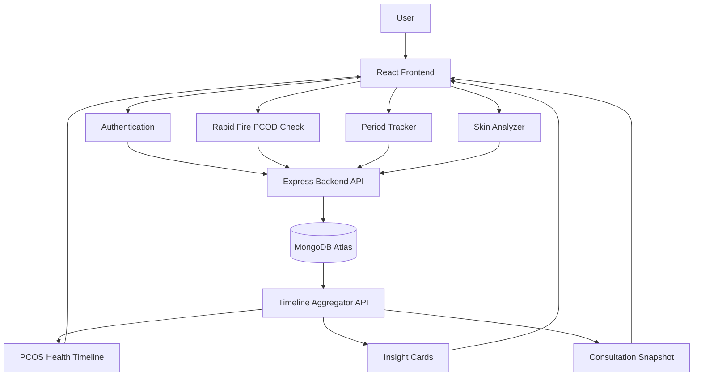
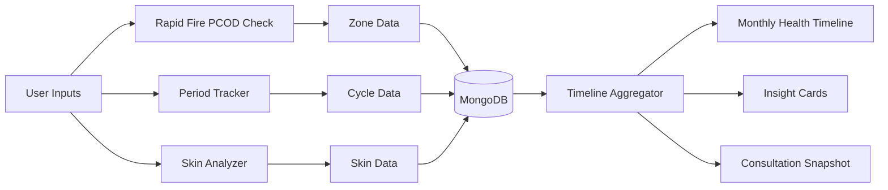
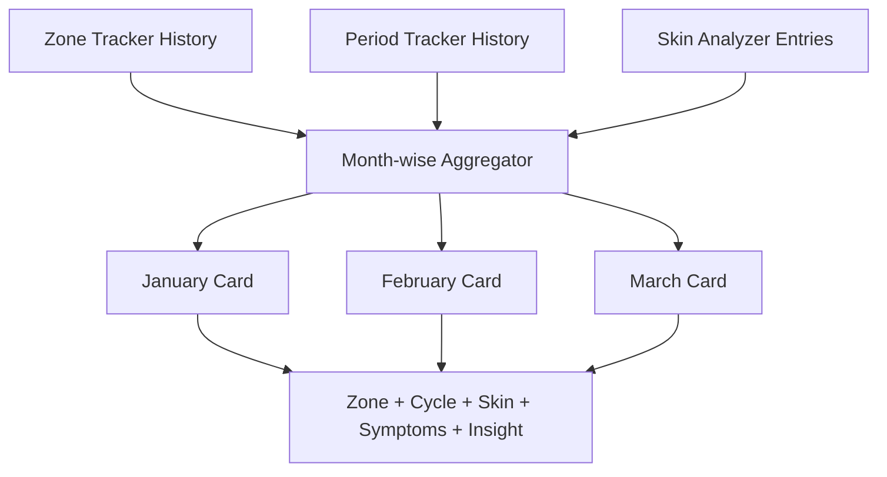
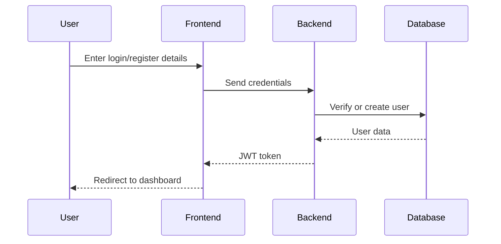

# 🌸 HerSpace — PCOD Awareness & Health Tracking Platform

HerSpace is a women’s health-focused web platform designed to help users understand, track, and reflect on early body signals related to PCOD/PCOS.

The project focuses on awareness, symptom tracking, cycle monitoring, skin analysis, health risk zones, monthly health timeline, personalized insight cards, and consultation-ready health summaries.

This project was built as part of a hackathon with the goal of making PCOD awareness more accessible, visual, and beginner-friendly.

---

## 🚀 Project Overview

Many women ignore early symptoms of PCOD because the signs often feel disconnected.

Irregular periods, acne, mood changes, weight changes, fatigue, lifestyle imbalance, and pain may appear separately, so users often do not realize that these symptoms may form a pattern over time.

HerSpace brings these body signals together in one place.

The platform helps users:

* Track period and cycle patterns
* Record symptoms and lifestyle inputs
* Understand PCOD awareness risk through zones
* Track skin-related concerns
* View a monthly PCOS health timeline
* Generate insight cards based on recurring patterns
* Prepare a consultation snapshot for doctor visits

---

## 💡 Core Idea

HerSpace is not a diagnosis tool.

It is an awareness and tracking platform that helps users notice recurring body signals early and organize their health data better.

The main goal is to convert scattered symptoms into a clear visual health story.

---

## ✨ Key Features

### 1. Rapid Fire PCOD Check

The Rapid Fire PCOD Check is a quick question-based flow where users answer simple health and lifestyle questions.

The questions are related to symptoms such as:

* Irregular periods
* Acne or skin issues
* Weight changes
* Hair fall or unwanted hair growth
* Mood changes
* Lifestyle habits
* Pain or discomfort

Based on the responses, the system estimates a PCOD awareness zone.

Example zones:

* Low Risk
* Moderate Risk
* High Risk

This feature gives users a simple starting point to understand their body signals.

---

### 2. Zone Tracker

The Zone Tracker stores the user’s PCOD risk zone history over time.

Every time a user completes the Rapid Fire PCOD Check, their zone result can be saved.

This helps users understand whether their body signals are:

* Improving
* Stable
* Getting worse
* Repeating in a pattern

The zone history becomes an important part of the Health Timeline.

---

### 3. Period Tracker

The Period Tracker allows users to record menstrual cycle details.

Users can track:

* Cycle start date
* Cycle end date
* Flow level
* Pain level
* Cycle regularity
* Symptoms
* Notes

This feature helps users understand their menstrual patterns over time.

The data from the Period Tracker is also used in the Health Timeline, Insight Cards, and Consultation Snapshot.

---

### 4. Skin Analyzer

The Skin Analyzer helps users track visible skin-related changes.

Users can add skin entries related to:

* Acne
* Oily skin
* Pigmentation
* Breakouts
* Skin condition changes
* Other skin concerns

Skin health is included because hormonal imbalance can often reflect through skin-related symptoms.

This feature helps users connect skin changes with cycle irregularity or PCOD risk patterns.

---

### 5. PCOS Health Timeline

The PCOS Health Timeline is one of the main new features of HerSpace.

It creates a month-wise visual summary of the user’s health journey by combining data from:

* Zone Tracker
* Period Tracker
* Skin Analyzer
* Symptoms
* Notes

Each month appears as a timeline card that shows the user’s overall PCOD-related health signals.

Each timeline card can include:

* Month name
* PCOD awareness zone
* Cycle status
* Flow level
* Pain level
* Skin condition
* Symptoms
* Short monthly insight

This helps users see their body patterns more clearly instead of checking every feature separately.

Example timeline card:

January 2026
Zone: Moderate Risk
Cycle: Irregular
Pain: High
Skin: Acne breakout
Insight: Cycle irregularity and skin breakout appeared together.

---

### 6. Insight Cards

Insight Cards generate small and easy-to-understand observations from the user’s health data.

Instead of showing only raw entries, the system highlights meaningful patterns.

Example insights:

Your cycle irregularity appeared frequently in the last few months.

Skin breakouts and high-risk zone appeared in the same month.

Pain levels seem to be reducing compared to previous entries.

Insight Cards help users understand trends quickly and clearly.

---

### 7. Consultation Snapshot

The Consultation Snapshot creates a simple health summary that users can show to a doctor or gynecologist.

It can include:

* Recent cycle history
* PCOD zone history
* Major symptoms
* Skin concerns
* Monthly timeline summary
* Important notes

This makes doctor consultations easier because users do not have to remember everything manually.

The Consultation Snapshot helps users present their health journey in an organized way.

---

## 🛠️ Tech Stack

### Frontend

* React.js
* Vite
* Tailwind CSS
* Netlify for deployment

### Backend

* Node.js
* Express.js
* MongoDB
* Mongoose
* JWT Authentication

### Database

* MongoDB Atlas

### Deployment

* Frontend: Netlify
* Backend: Node.js hosting platform
* Database: MongoDB Atlas


---


## 📁 Project Structure


```bash
HerSpace-build-a-thon/
│
├── client/
│   ├── src/
│   │   ├── components/
│   │   ├── pages/
│   │   ├── context/
│   │   ├── services/
│   │   └── App.jsx
│   └── package.json
│
├── server/
│   ├── models/
│   ├── routes/
│   ├── controllers/
│   ├── middleware/
│   ├── config/
│   └── server.js
│
├── README.md
└── package.json

```

---

## 🧩 System Architecture



---

## 🔄 Data Flow



---

## 🗓️ Health Timeline Flow



---

## 🔐 Authentication Flow



---

## 🔗 Important Links

### GitHub Repository

[HerSpace GitHub Repository](https://github.com/pranatishah123/HerSpace-build-a-thon)

### Live Demo

Frontend Live Link: Add Netlify link here
Backend API Link: Add backend deployed link here

### Demo Video

Demo Video Link: Add demo video link here

---

## ⚙️ Installation and Setup

### 1. Clone the Repository

git clone [https://github.com/pranatishah123/HerSpace-build-a-thon.git](https://github.com/pranatishah123/HerSpace-build-a-thon.git)
cd HerSpace-build-a-thon

---

### 2. Install Frontend Dependencies

cd client
npm install

Run frontend:

npm run dev

---

### 3. Install Backend Dependencies

Open a new terminal and run:

cd server
npm install

Run backend:

npm run dev

---

## 🔐 Environment Variables

Create a `.env` file inside the backend or server folder.

PORT=5000
MONGO_URI=your_mongodb_connection_string
JWT_SECRET=your_jwt_secret

Create a `.env` file inside the client folder if needed.

VITE_API_BASE_URL=your_backend_api_url

---

## 📡 API Routes

### Authentication Routes

POST /api/auth/register
POST /api/auth/login

### Rapid Fire / Zone Tracker Routes

POST /api/zones
GET /api/zones/me

### Period Tracker Routes

POST /api/period
GET /api/period/me

### Skin Analyzer Routes

POST /api/skin
GET /api/skin/me

### Health Timeline Route

GET /api/timeline/me

This endpoint aggregates zone history, period history, skin entries, symptoms, and notes into a month-wise health timeline.

### Insight Cards Route

GET /api/insights/me

This endpoint generates pattern-based observations from the user’s health data.

### Consultation Snapshot Route

GET /api/snapshot/me

This endpoint creates a summarized health report that can be shared during doctor consultation.

---

## 🧠 Simple Data Flow

User Inputs
↓
Rapid Fire PCOD Check / Period Tracker / Skin Analyzer
↓
MongoDB Storage
↓
Timeline Aggregator API
↓
Insight Cards + Consultation Snapshot
↓
Frontend Visual Dashboard

---

## 🖼️ Health Timeline Concept

The Health Timeline displays each month as a card.

Each card can include:

* Month name
* PCOD awareness zone
* Cycle status
* Flow level
* Pain level
* Skin condition
* Important symptoms
* Short insight

Example:

January 2026
Zone: Moderate Risk
Cycle: Irregular
Pain: High
Skin: Acne breakout
Insight: Cycle irregularity and skin breakout appeared together.

---

## 🎯 Why HerSpace Matters

PCOD symptoms are often ignored because they appear slowly and separately.

A user may notice acne one month, irregular periods another month, and fatigue later. Since these symptoms are not always viewed together, early patterns can be missed.

HerSpace helps users connect these signals over time.

Instead of giving a medical diagnosis, it gives users better awareness, better tracking, and better preparation before consulting a doctor.

---

## ⚠️ Disclaimer

HerSpace is an awareness and tracking platform.

It does not provide medical diagnosis, treatment, or prescription advice.

Users should consult a certified doctor or gynecologist for medical concerns.

---

## 🔮 Future Scope

* AI-based personalized health suggestions
* Exportable PDF health report
* Doctor dashboard
* Period and symptom reminders
* Improved skin analysis using dermatology datasets
* Lifestyle recommendation engine
* Multi-language support
* Mobile app version
* Community support space
* Secure report sharing with doctors

---

## 👩‍💻 Built By

**Pranati Shah**

GitHub: [pranatishah123](https://github.com/pranatishah123)
LinkedIn: [Pranati Shah](https://www.linkedin.com/in/pranatishah13/)

---

## 📌 Project Status

Current status: Active hackathon prototype

Latest planned / added features:

* PCOS Health Timeline
* Insight Cards
* Consultation Snapshot
* Netlify frontend deployment
* Backend deployment with MongoDB Atlas integration

---

## 🏁 Final Note

HerSpace is built with the belief that women should not have to ignore their body signals or remember every symptom alone.

By combining tracking, visual timelines, and simple insights, HerSpace helps users understand their health journey with more clarity and confidence.
